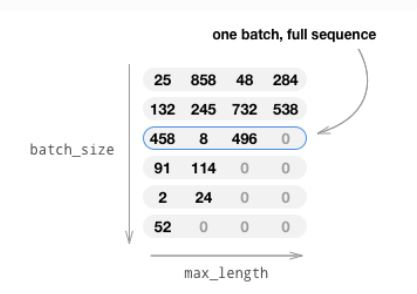
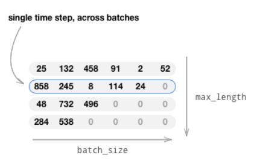

由于神经网络往往都是一批（一个Batch)的数据输入，然后进行训练，batch_size可以为8,16,32等，而不会为1。例如输入文本如下：
```
你      在      干    什么 
你     是不是   傻     啊
快给我  讲个    笑话  [PAD]
早上    好     [PAD] [PAD]
吃饭    了     [PAD] [PAD]
无聊   [PAD]   [PAD] [PAD]
```
有6个输入句子，batch_size=6，max_length=4，对数据进行embedding并转换为张量，如下图所示：

<!--more-->
此时的张量大小为(batch_size,max_length)，每一维就是一整句话，这样神经网络的每个时间步得到的都是完整的序列。而实际上，在神经网络的每个时间步都应该包含到所有序列。因此需要将张量进行转置为(max_length,batch_size):

所以其实在0 time step中，输入的是[你 你 快给我 早上 吃饭 无聊]